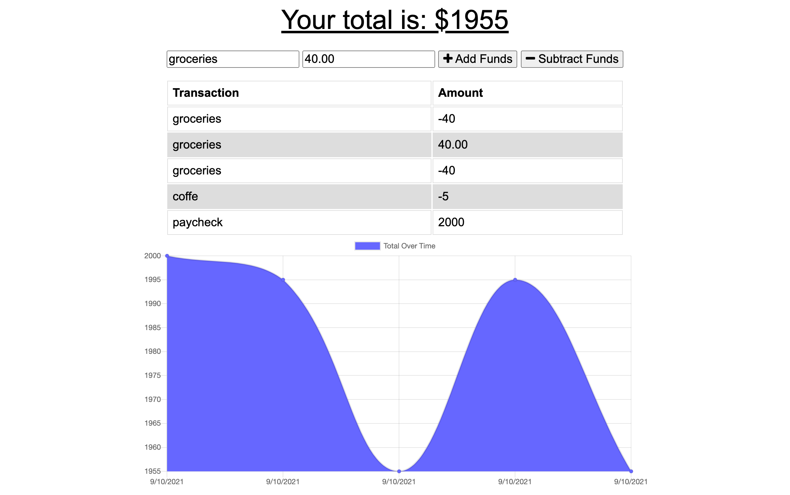
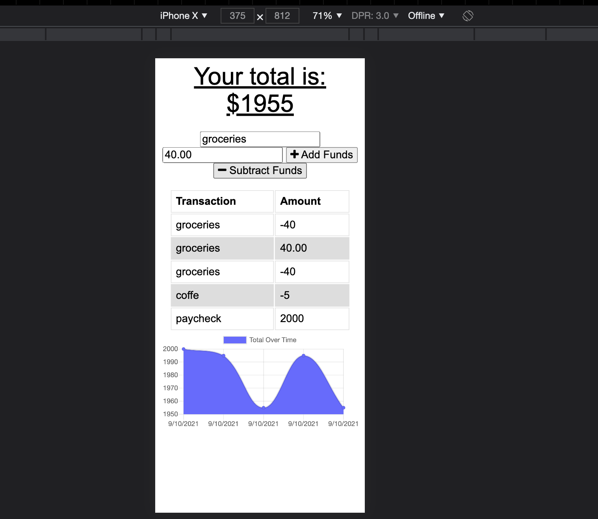

# Budget Tracker
## **Description**  
-------------
Budget Tracker is a progressive web application that helps user keep track of their expenses and their expenses. A great app for those who are on the go and need something quick to be able to track their daily budgets, even when offline!

 ## **How to Use**
 ---------------
- The user would start at the homepage where they are able to see their income at once, with a graph that updates with every new entry! The options to add and subtract options are found here as well

-To enter an entry the user would fill in the name of the transaction (e.g. Groceries). Then they would enter the amount in the new field (e.g. 40.00) and they can select to add or subtract the funds. 

-The transaction would then be registered to the transaction and amount table. User can see the history of their entries. 

  -At the bottom, the user will find the graph with their history of transaction by date. 

- If a user does not have a connection, they are still able to enter transactions while offline.  The image below shows, an completed with an offline throttle through dev tools. 

## **Built With**
---------------
- 
- 
- 
- 
- 
- 
- 

## **Contributors**
--------------------
  

- Rudy S. [GitHub](https://github.com/Rudys212)

## **License**
--------------------
MIT License

Copyright (c) 2021 Rudys212

Permission is hereby granted, free of charge, to any person obtaining a copy
of this software and associated documentation files (the "Software"), to deal
in the Software without restriction, including without limitation the rights
to use, copy, modify, merge, publish, distribute, sublicense, and/or sell
copies of the Software, and to permit persons to whom the Software is
furnished to do so, subject to the following conditions:

The above copyright notice and this permission notice shall be included in all
copies or substantial portions of the Software.

THE SOFTWARE IS PROVIDED "AS IS", WITHOUT WARRANTY OF ANY KIND, EXPRESS OR
IMPLIED, INCLUDING BUT NOT LIMITED TO THE WARRANTIES OF MERCHANTABILITY,
FITNESS FOR A PARTICULAR PURPOSE AND NONINFRINGEMENT. IN NO EVENT SHALL THE
AUTHORS OR COPYRIGHT HOLDERS BE LIABLE FOR ANY CLAIM, DAMAGES OR OTHER
LIABILITY, WHETHER IN AN ACTION OF CONTRACT, TORT OR OTHERWISE, ARISING FROM,
OUT OF OR IN CONNECTION WITH THE SOFTWARE OR THE USE OR OTHER DEALINGS IN THE
SOFTWARE.

## **Links** 
---------------
- [GitHub Repo](https://github.com/Rudys212/budget-tracker)

- [Deployed app in Heroku](https://aqueous-brushlands-42848.herokuapp.com/)